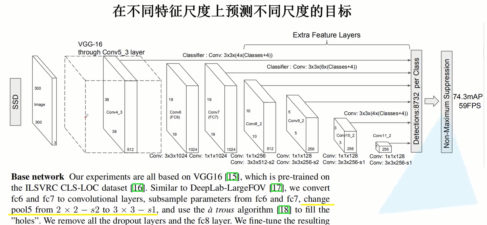
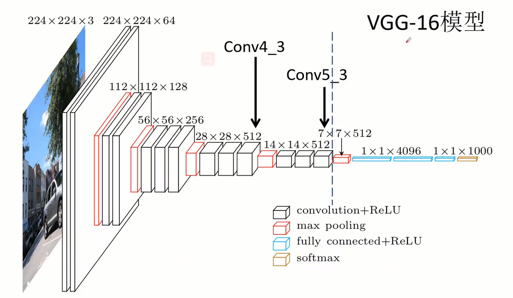
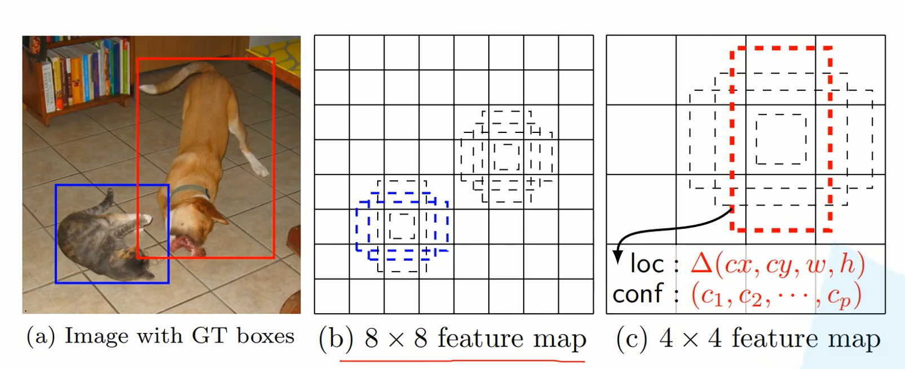
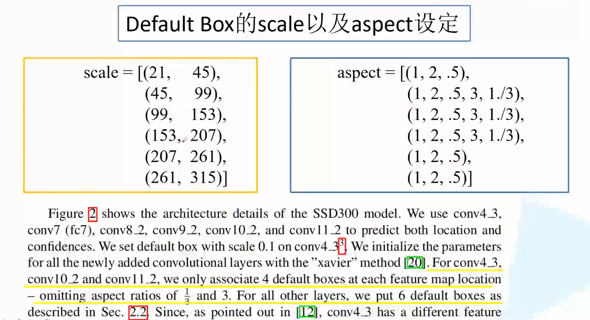
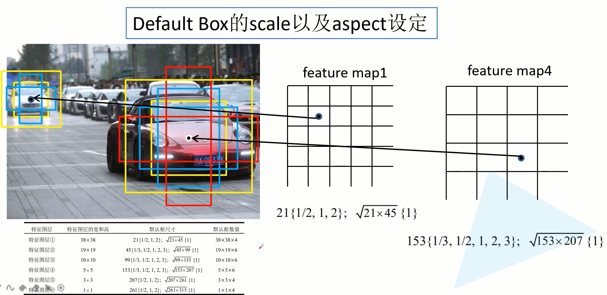
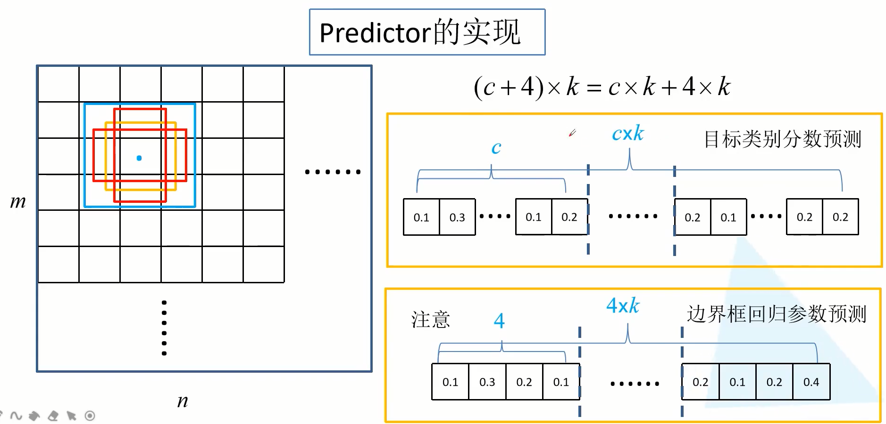

# SSD论文和源码分析

## 网络结构

#### backbone VGG16

#### Default Box和Scale

**Scale：**6个特征层，每个特征层对应两种尺度$s_k, \sqrt{s_k*s_{k+1}}$，如第一scale=(21, 45)，其中$s_k=21, s_{k+1}=45$，故第一个特征层有$21$和$\sqrt{21*45}$这两种尺度，其他类推

**aspect**：每层的第一个尺度$s_k$，都有多种aspect；而第二个尺度$\sqrt{s_k*s_{k+1}}$只有1这一个aspect。由下图右侧显示。

故6个特征层，每个对应的default box的数量为：4, 6, 6, 6, 4, 4。

#### Predictor

