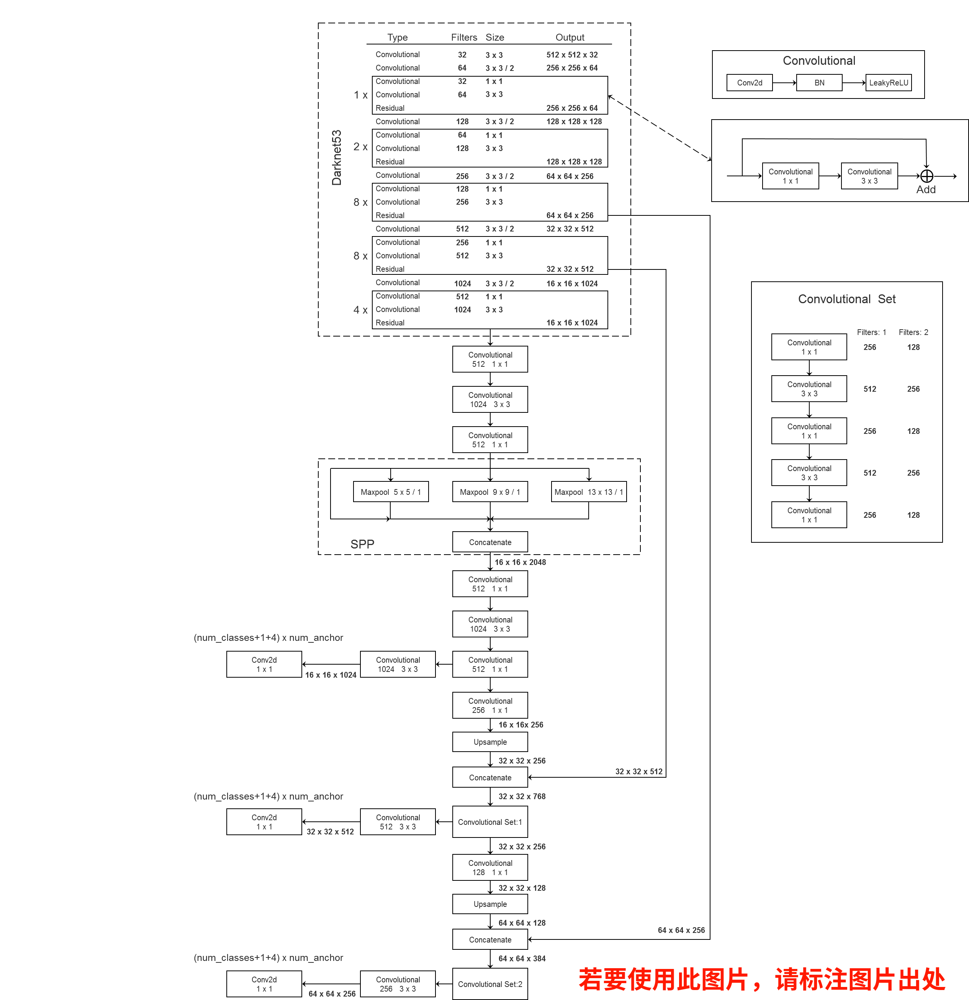

# YOLO论文和源码解析

## YOLOv1

### 网络结构

输出：

### 损失

## YOLOv2

### 网络结构

#### Backbone-Darknet19

#### YOLOv2模型

将Darknet19最后一部分卷积进行替换，得到如下模型结构：

## YOLOv3

### 网络结构

没有Maxpooling层，下采样通过卷积层设置stride为2来实现，比resnet提升

### 尺度

在三个特征层上进行预测，每个特征层上有三种尺度的box。

同样经过k-means算法，得到9个聚类中心，分成3组，刚好对应三个特征层，每个特征层三种尺度。

对每个尺度$N*N$大小的特征图，对COCO数据集而言，则数据维度为$N*N*[3*(4+1+80)]$，每个点有3个boxes，每个box预测4个边界框参数，1个物体confidence，80个类别分数。

### 边界框预测

### 损失函数

损失函数由三个部分构成

## Yolov3 SPP

### 增加部分

### 网络结构

### SPP模块

SPP模块会将通道数增加4倍

### 损失

#### IOU loss

两种形式：$loss = -ln(IOU)$或$loss = 1 - IOU$。

缺点是，两者不相交时，IOU=0，损失为无穷大或1。

#### GIOU loss

$A^c$是两矩形框的最小边界框，$u$是两矩形的并集部分。

完美重合时$GIoU = IoU - 0 = 1$，不相交且无穷远时$GIou = 0 - 1 = -1$。

损失为：$L = 1 - GIoU$

#### DIOU loss

#### CIOU loss

#### Focal loss

$\gamma=2, \alpha=0.25$的情况，可以看到易分样本的权重降低很多：

## 参考

https://github.com/WZMIAOMIAO/deep-learning-for-image-processing